# Variable Font Substitution Mapper
**Current Version: 0.9.6, in development.**

🎥 Watch our 2021 Typographics TypeLab talk [here](https://vimeo.com/568482316)

This tool provides a visualizer and font variation substitution manager for `.ttf` variable fonts. The tool helps with setting up glyph substitutions (also called OpenType [Required Variation Alternates](https://docs.microsoft.com/en-us/typography/opentype/spec/features_pt#tag-rvrn), or `rvrn`) that depend on the design space region. It can build substititions for many different glyphs visually. Once you're done setting up substititions, the tool will generate a `<rules>` element that you can paste into a `.designspace` file. With this updated file, you can rebuild your `.ttf` using fontmake and get a variable font with complex substitution patterns.

This document walks you through how to accomplish this with our tool.

## A Note about the Project

This project originated at Occupant Fonts over the spring and summer of 2020. We were stuck inside, trying to successfully build our variable font projects, and trying to get our substitions to work – all without going to crazy from the stress of COVID-19.

The visualizer is a project that we built to suit our needs as a studio. It has a lot of rough edges, and is not really a "product-ready" tool. If you're interested in using, you'll need to work through a few steps to get your fonts ready for the tool, and a few steps to get a working variable font with substitutions out of it.

We develop this tool when we find new needs or features for specific projects we have, but we don't develop it outside of that much. So, as new projects come up, expect the tool to evolve, but don't expect it to be actively developed on a weekly basis.

If you do use the tool and find issues or have suggestions, you're welcome to open up issues on this repository!

## Terminology

Substitutions, or "Required Variation Alternates," determine how glyphs should be substituted depending on coordinates in your designspace. This section intros some terminology that we use throughout the application.

### Substitutions
A substitution is a group of glyphs that represent the same unicode point. When that unicode is requested, the glyph that is rendered depends on the current variation settings of the font.

A substitution has a default glyph and any number of substitutes, which are swapped in at different regions in the designspace. As a table, a substitution might look something like this.

|  | Default | Substitute 1 | ... | Substitute N |
| - | --- | --- | --- | --- |
| **Glyph** | `won` | `won.sub_bar1` | ... |  `won.sub_barN`|
| **Region** | *Region 0* | *Region 1*  | ... | *Region N* |

The *Region* elements here are stand-ins for rectangular staircases in the design space.

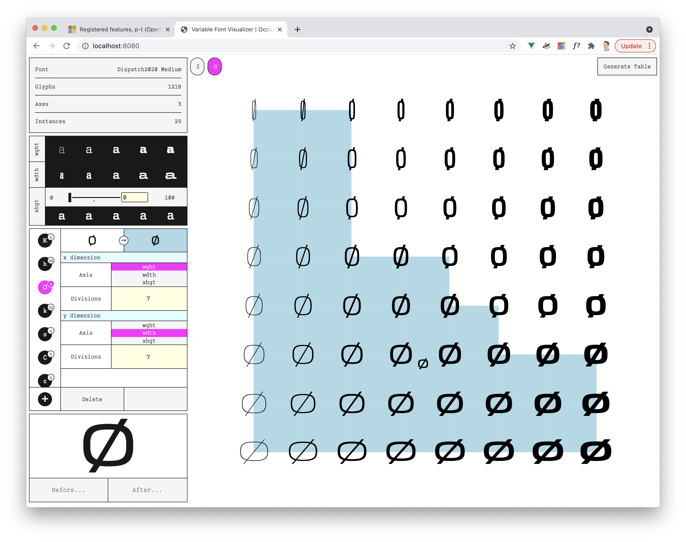

*The blue "staircase" shows the "Region" where a substitution is applied to the font. Whenever the coordinate is inside this 2D region (the x dimension representing `wght` and the y dimension representing `wdth`), the barless `oslash` will be swapped for the barred `oslash.sub_bar`.*

### Substitutions with Subordinates

Oftentimes, we want multiple substitutions to follow the same pattern of regions. The visualizer supports associating multiple substitutions together. We call these grouped substition patterns "subordinate patterns."

|  | Default | Substitute |
| - | --- | --- |
| **Glyph** | `Q` | `Q.sub_bar` |
| **Glyph** | `Oslash` | `Oslash.sub_bar` |
| **Glyph** | `oslash` | `oslash.sub_bar` |
| **Glyph** | `Oslashacute` | `Oslashacute.sub_bar` |
| **Glyph** | `oslashacute` | `oslashacute.sub_bar` |
| **Region** | *Region 1* | *Region 2* |

Just like regular substitutions, substitutions with subordinates can have any number of glyphs. The catch is, each subordinate must have **the same** number of glyphs, whatever that number is.

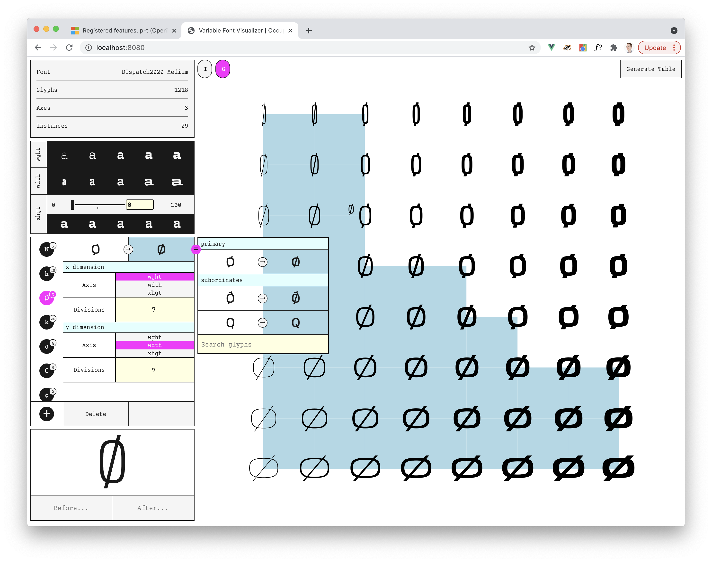

*Using subordinates, large numbers of glyphs can be grouped together and use the same substitution pattern across the designspace. We often use this for small weight adjustments or serif adjustments.*


## Glyph Naming Conventions

**NOTE: These naming conventions are based on what we use at Occupant Fonts. We know that they won't work for everyone. The visualizer can be used without them, as susbtitutions and subordinates can be created in the interface.**

It's possible to set up and manage all your substitutions and subordinates through the visualizer interface.  However, this can be a time consuming process in itself. Because of this, the visualizer provides some naming conventions The variable font visualizer will automatically generate susbtitution and subordinate sets for you, if you name your substitution glyphs in the following parts. Each of the parts is joined together with a separator. We use a period (`.`) to start off the string, and then underscores (`_`) inside it.

|   | Base Glyph Name | Tag | Substitution Class | Instance (optional) |
| - | - | - | - | - |
| **Pattern** | `{glyph}` | `sub` | `{class}` | `{id}`
| **`Q.sub_bar`** | `Q` | `sub` | `bar` |
| **`Oslash.sub_bar`** | `Oslash` | `sub` | `bar` |
| **`won.sub_bar_1`** | `won` | `sub` | `bar` | `1`
| **`won.sub_bar_2`** | `won` | `sub` | `bar` | `2`
| **Notes** | This is the name of the glyph for which this substitution applies. | This tag identifies this glyph as a substitution. All substitution glyphs have this tag, which makes them easily searchable. | The class name is an arbitrary identifier that groups substitutions that should follow the same pattern together. | The instance identifier is a unique per-base-glyph, and allows for multipls substitutions per base-glyph. If there is only one substitute for the base glyph in the class, no instance id is needed.

Substitutions are grouped together as subordinates under two conditions:

1. The two substitutions have the same Substitution Class (the `bar` in the examples above), and
2. The two substitions have the same number of substitutes.

If these two conditions hold, then the susbtitutions will be grouped together as subordinates. If either of them does not hold, then the substitutions will not be grouped together.

As a caveat: If you use this notation, then no other glyph names in your project should contain `.sub_` (this is the string our preprocessor uses to identify substitutions) as a substring in their names. Hopefully this isn't too arduous of a restriction 😊.


## Using the tool

There are a few steps that you need to take in order to use the visualizer:

1. Preparing your `.glyphs` file with private unicode assignments.
2. Installing tools (only need to do this once).
3. Generating a `.designspace` representation of your `.glyphs` file.
4. Generating a visualizer-compatible `.ttf` file.
5. Updating the `.designspace` file with the visualizer output.
6. Compiling the final, production-ready `.ttf` file.

We'll go through each of these steps in detail here.

**Note:** At Occupant Fonts, we use Glyphs.app for most of our drawing. These instructions are based on coming from Glyphs.app, where you're working with `.glyphs` sources, and you need to convert them to `.designspace` / `.ufo`. If you're in Robofont, you're one step ahead, and you should be skip to step 3.

### 1. Preparing your Source file

In order to find the alternate glyphs that you want to use in substitutions, you need to assign them to unicode values. This lets the browser render them, and ensures that they'll be searchable by glyph name in the visualizer interface. Luckily, we can assign these glyphs to "private unicodes" that aren't assigned to key bindings by default. This means you won't be able to type them, but they'll show up in the visualizer, and the web browser will be able to render them.

[Private unicodes](http://www.unicode.org/faq/private_use.html#:~:text=There%20are%20three%20ranges%20of,Private%20Use%20Area%20(PUA).) are just unicode values in the range `E000` to `FF8F`, giving us **6,400** possible substitution glyphs. If you need more than 6,400 substitution glyphs, there are more private unicode ranges further out in "unicode space" – although if you're managing thousands of substitutions, this might not be the best tool for you.

You're free to assign any of these values to each of your substitution glyphs. It doesn't matter which. A simple script in Glyphs or Robofont could be used to accomplish this.

Cyrus also recommends a consistent naming convention for your substitution glyphs. He uses `{glyph name}.sub_bar` for most glyphs with this kind of behavior. This also makes it easy to search for substitutions, by searching for "sub" or "bar" in the visualizer.


### 2. Installing Tools

You might not have the required commands for building `.ufo` files and font binaries installed right now. You can install all the required tools (`glyphs2ufo` and `fontmake`) by installing the `fontmake` package. To do this, open your terminal and run:

```sh
pip3 install fontmake
```

This will add both of these tools to your system, and make them accessible from your terminal.

### 3. Generating a `.designspace`

Next, we need to generate a `.designspace` file with `.ufo` files for each master. This is pretty easy with the `glyphs2ufo` tool, a [command line tool](https://github.com/daltonmaag/glyphs2ufo) which does exactly what it sounds like.

To start, you need to navigate to your project folder. To do this, find the folder in Finder. Type `cd ` (with a space after) into your terminal, and then drag the folder icon into the terminal. You should get something like this:

```sh
cd path/to/my/project/folder
```

with some long filesystem path to the folder you dragged. Hit enter to go to that folder in your terminal.

Now that you're in the proper folder in your terminal, we can run the `glyphs2ufo` command. Type:

```sh
glyphs2ufo GlyphsFile.glyphs -m ufos
```

This will generate a set of `.ufo` files and a `.designspace` file, and put them into an new folder called `ufos` in your current directory.

*Note: theoretically, it should be possible to roundtrip back to a glyphs file from your designspace file. So, after you paste the `<rules>` output from your designspace file, you might be able to bring those rules back into glyphs, and export from there. However, I have not tested this, and do not know how well this kind of roundtrip works. So, it's best to generate substitutions as the last step in your production process.*


### 4. Preparing and Cleaning your `.designspace`

When your `.designspace` file comes out of `glyphs2ufo`, it's not always 100% ready for the visualizer. Depending on the settings of your Glyphs file, the `glyph2ufo` tool will attempt to remap your axis coordinates to standard coordinates specified by the OpenType spec. If you're coming from RoboFont, you probably don't need to worry about all this stuff!

For example, if you have a `wght` axis ranging from `0` to `1000`, the tool will attempt to remap this axes to `[100, 900]`.

This is a problem for us, since we need to specify our substitituions in terms of the coordinate system we defined (`0` to `1000`), not some other one. To make sure of this, we'll need to modify the `<axes>` element in the `.designspace` file.

When we generates a three axis variable font (containing Weight masters, Width masters, and virtual X-height masters) from Glyphs, we got a `.designspace` file with the following axis tag:

```xml
<axes>
  <axis tag="wght" name="Weight" minimum="100" maximum="900" default="492.307692">
    <map input="100" output="0"/>
    <map input="200" output="125"/>
    <map input="300" output="250"/>
    <map input="500" output="510"/>
    <map input="700" output="825"/>
    <map input="900" output="1000"/>
  </axis>
  <axis tag="wdth" name="Width" minimum="50" maximum="200" default="100">
    <map input="50" output="0"/>
    <map input="75" output="250"/>
    <map input="100" output="500"/>
    <map input="125" output="750"/>
    <map input="200" output="1000"/>
  </axis>
  <axis tag="xhgt" name="Xheight" minimum="0" maximum="0" default="0"/>
</axes>
```

Notice that our range for the weight and width axes, both `0` to `1000`, have been replaced by the OpenType Spec recommended values. These recommended values are specified in the minimum and maximum of each `<axis>` tag, and the mapping from our range to the recommended range is implemented with `<map>` tags.

The key thing to know here is that these `<map>` elements are applied only after all other data in the `.designspace` file has been specified. The positions of masters and instances, as well as the location of feature variations, are specified in the **original range**, `0` to `1000`, not the mapped range of `100` to `900` (in the case of weight). The visualizer needs to produce features in the original range, not the mapped range.

To do this, we can just delete the `<map>` elements and make sure the `<axis>` tags have the original ranges. If you like, you can keep the mapped table for later, and paste it back in after you've generated the sequence. To prepare for the visualizer, we updated the table above to the following one:

```xml
<axes>
  <axis tag="wght" name="Weight" minimum="0" maximum="1000" default="500" />
  <axis tag="wdth" name="Width" minimum="0" maximum="1000" default="500"/>
  <axis tag="xhgt" name="Xheight" minimum="0" maximum="100" default="0"/>
</axes>
```

Now that the mapping is removed, the visualizer will generate features using the correct, original coordinate system for the axes.

#### A Note About Virtual Masters

While you're doing this, it's a good idea to check the ranges on your axis tags, too. If you're using virtual masters to implement axes in Glyphs, the export process can sometimes collapse these axes onto *no* range, which causes `.ttf` compilation to fail.

When we generated an `xhgt` axis using virtual masters the result axis in the `.designspace` file was specified as going from `0` to `0`, when we wanted `0` to `100`. A quick change in the `<axis>` tag for that axis solved the problem.


### 5. Generating a `.ttf`

The VF visualizer works with font binaries, so we need to generate a variable `.ttf` file. We can do this with the library [`fontmake`](https://github.com/googlefonts/fontmake) from Google. `fontmake` glues together a bunch of different utilities into a single swiss-army knife.

`glyphs2ufo` generated a new folder called `ufos` for us, with all of our masters and designspace file in it. To move to that new folder, type:

```sh
cd ufos
```

Now that you're in the right folder, go ahead and build a `.ttf` for the visualizer:

```sh
fontmake -m DesignspaceFile.designspace -o variable --no-production-names
```

This command eats a `.designspace` file, and tries to compile it into a TrueType variable font. The `--no-production-names` flag specifies that we don't want to rename any of our glyphs to AGL-standards-compliant glyph names. This is important, otherwise the `<rules>` table the visualizer generates will have unicode identifiers, rather than names, for certain glyphs, and the `.designspace` file won't understand these. The final `.ttf` we build will have production names, don't worry.

If everything works properly, this command will create a new folder called `variable_ttf`, which will contain the compiled `.ttf`. That's the file that you can drag into the visualizer. If you want to open the `ufos` folder to see the new files in Finder, you can type:

```sh
open .
```

In the terminal. This should open up a finder window with the current folder. From there, you can drag the file into the visualizer: [here](https://morisawausa.github.io/_vfvisualizer).

### 6. Generating Rules

#### 6.1 Making a Substitution

Drag your `.ttf` onto the visualizer webpage to get started. The webpage should parse the `.ttf` and render a side panel. Once that's done, you'll see an empty visualizer, ready for you to create substitutions. (If you used our naming convention, you'll see some pre-made substitions with one of them activated).

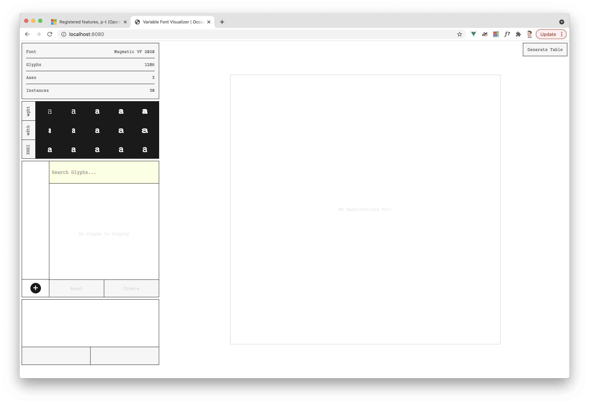

To create a substitution, type in the yellow `Search Glyphs...` box to search for the glyph you want to substitute by name. We call this region of the screen the substitution manager box.

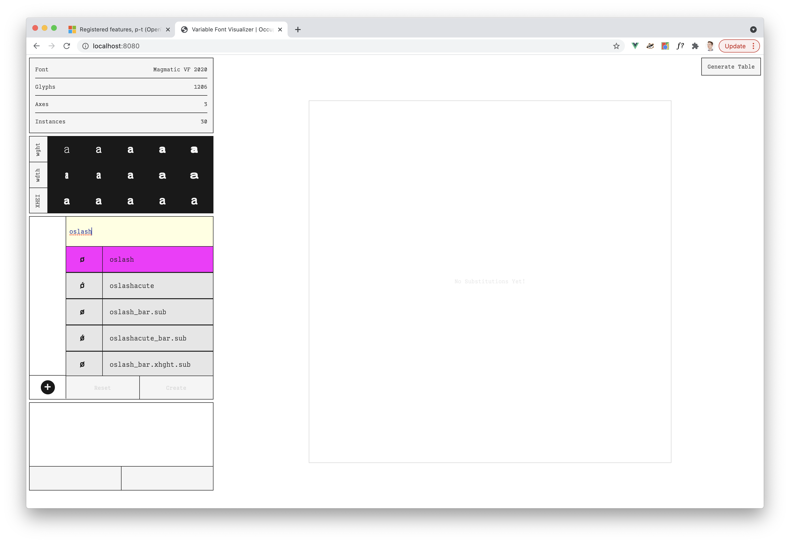

Click the glyph in the scrollable dropdown, then repeat the process to find the glyph you want to swap in.

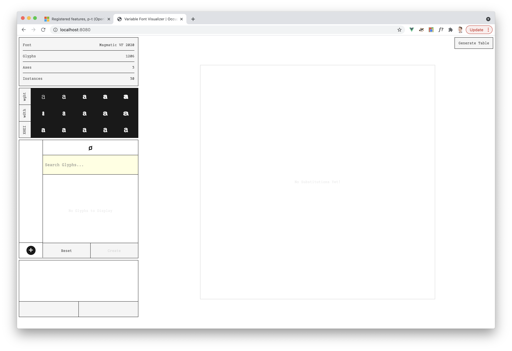
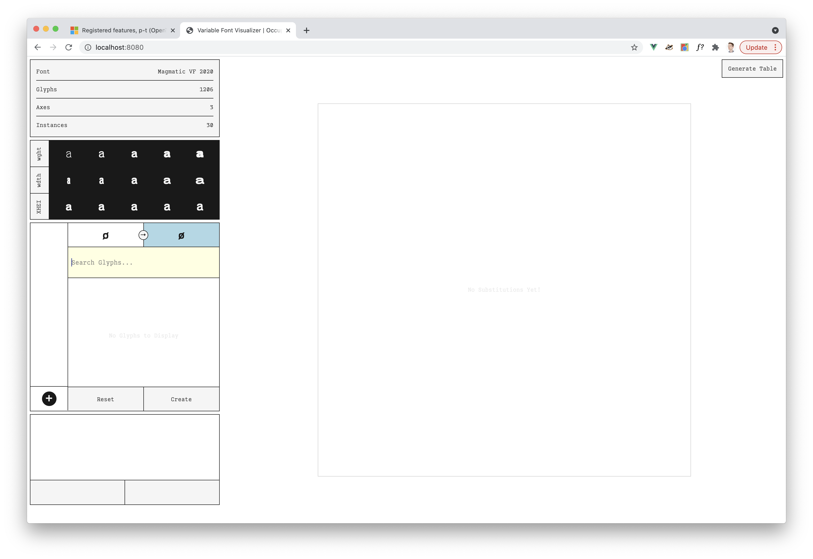

You'll see a list of the substututing glyphs at the top. Click create in the bottom right of the box to enable the substitution.

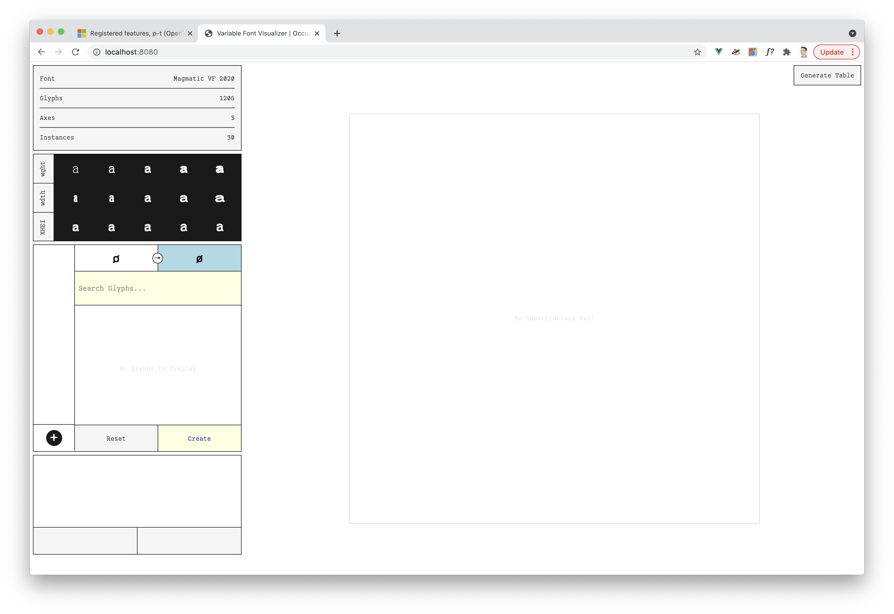
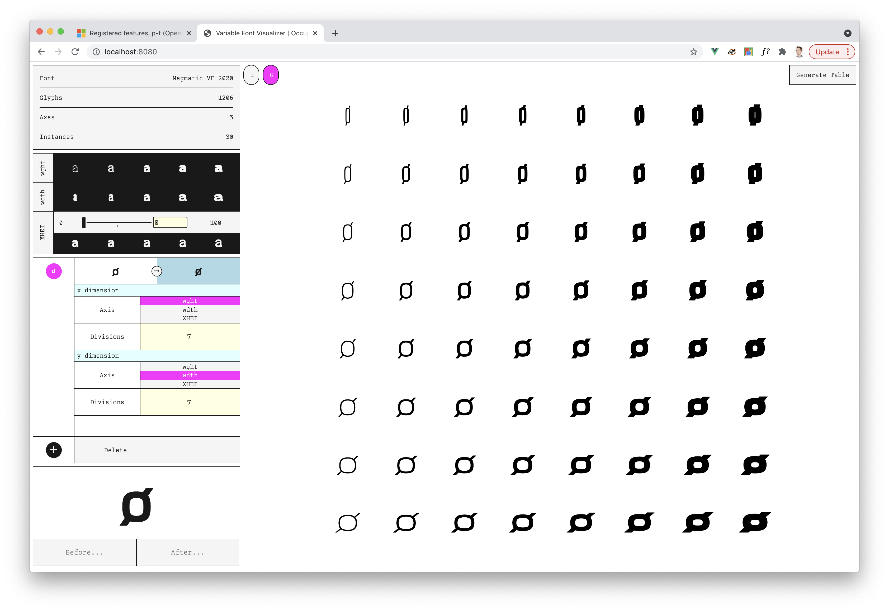

Your substutution is ready for editing.

#### 6.2 Making Subordinates

You may want to add more glyphs to this substitution, if you'd like them all to transform in the same way.

Click header of the substitution manager box (where you see the `oslash` transitioning to the `oslash.sub_bar` in these examples) to bring up a list of subordinates in this substutution (you can click again to close it).

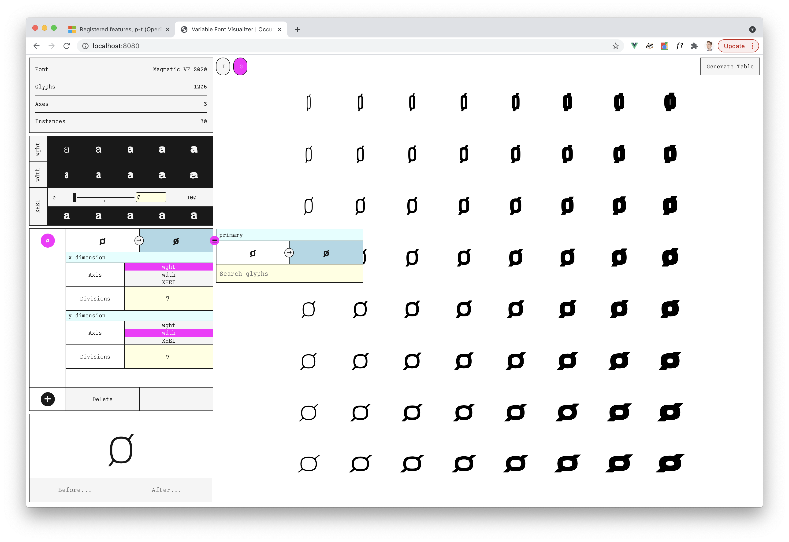

Search in the yellow search box in the pop-up to find the glyphs you want to add to the substitution.

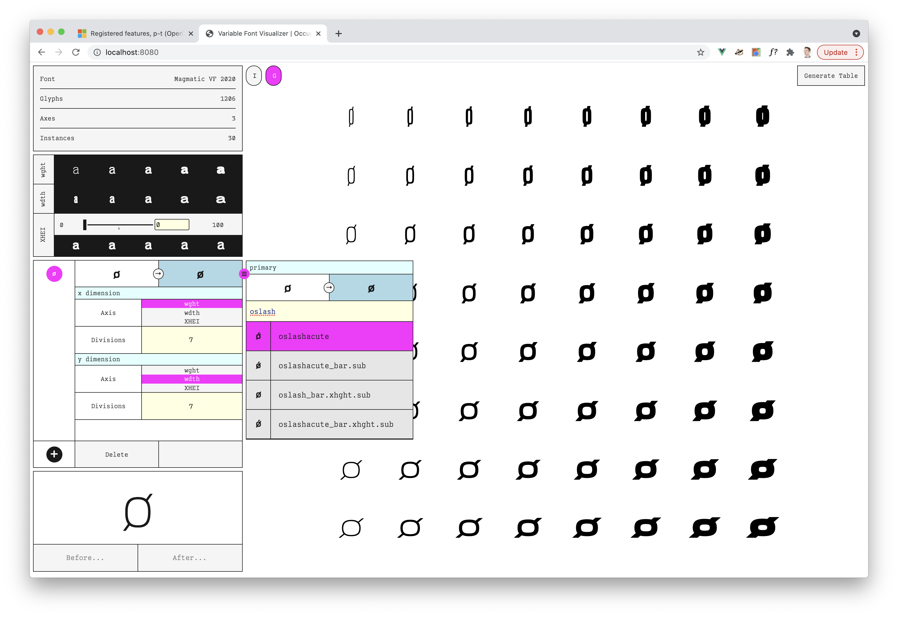
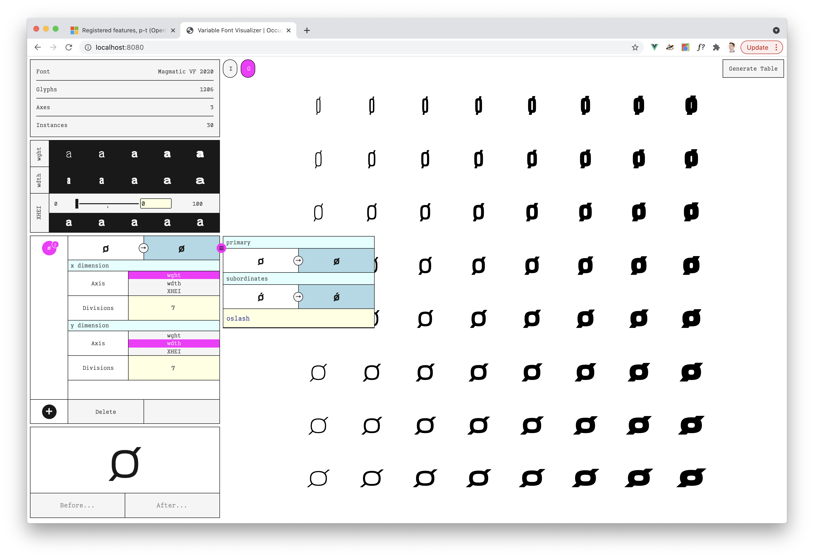

Repeat this for as many glyphs as you like.

If you make a mistake, or want to remove subordinate, hover over it in the list. You'll see a set of three, black icons appear.


Clicking the backspace icon (⌫), all the way to the left, will remove the subordinate. Clicking the up-down arrow (⇅), in the middle, will swap this subordinate into the grid, so you can see it. Clicking the plus icon (+), all the way to the right, will add this glyph to the grid, next to any other glyphs in the grid.

Repeat this process as many times as needed to generate all your subordinates.

#### 6.3 Changing the Axes.

The visualizer displays 2 axes at a time. You can assign which axes are displayed on a per-substitution basis. By default, the first two registered axes are displayed. The third one can be scrubbed across using the slider in the top left, just below the box displaying font info.

To change the active axes, find the dimension you want to change (`x` or `z`), click the axis tag you want to assign.

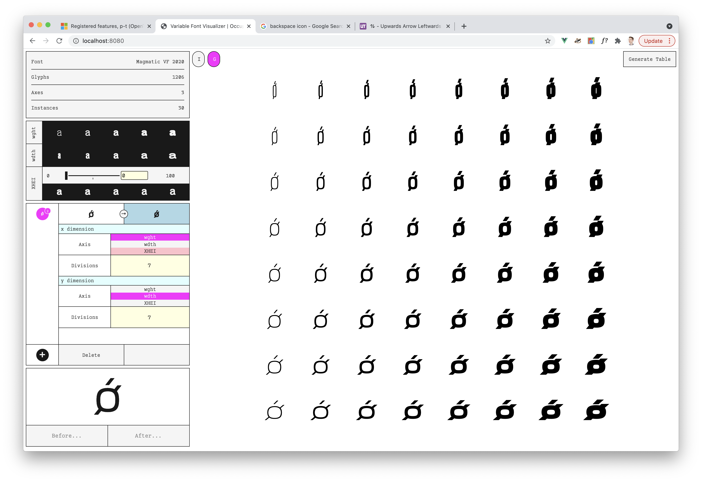


By default, the visualizer creates seven divisions each for the first two registered axes, and 2 each for all subsequent axes.

#### 6.4 Changing the Grid Region Count

To change the subdivisions along a specific axis, choose the substitution you want, assign the axis you want to change to a given dimension, click in the yellow box, and change the number to the desired number of regions. Below, I changed the number of width regions from 7 to 3.

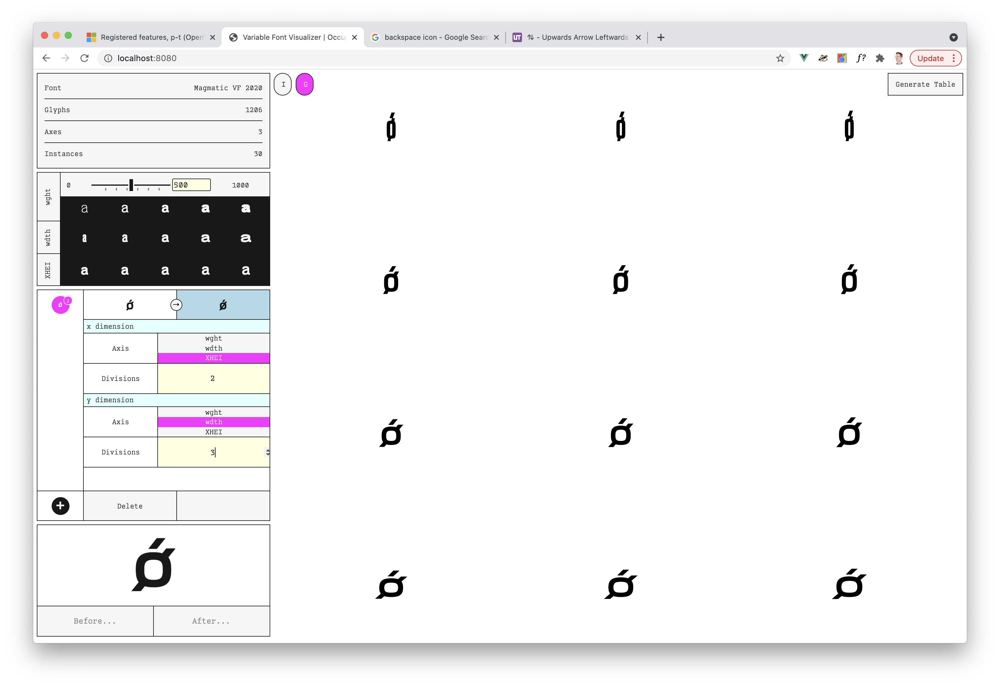

###### **⚠️⚠️ WARNING ⚠️⚠️**
Changing the number of grid divisions will ERASE the substitution pattern you currently have. Be sure to set your substitution grid sizes **before** you start making patterns. This hasn't been a huge limitation for us, but fixing it is a nice-to-have.

#### 6.5 Make Substitutions

Making substutition patterns is clicking in the grid.

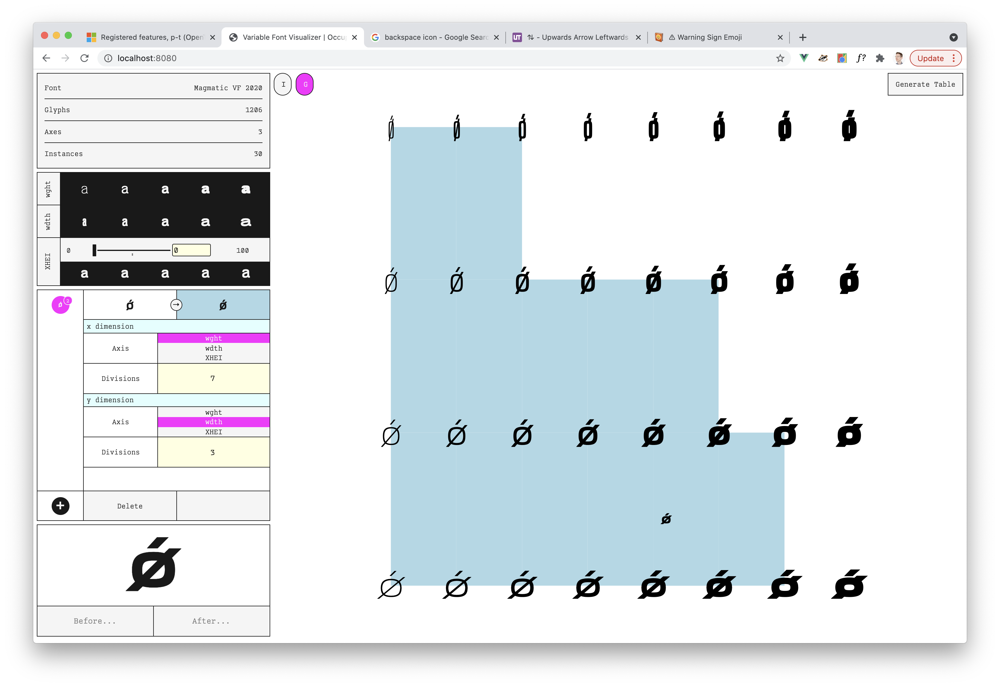

To remove a substituted region, just click on it again.

You can also use the pill-shaped icons, in the top-left to the right of the info box, to toggle various visualizer states. Clicking the "I" button toggles instance locations in the grid, for example.


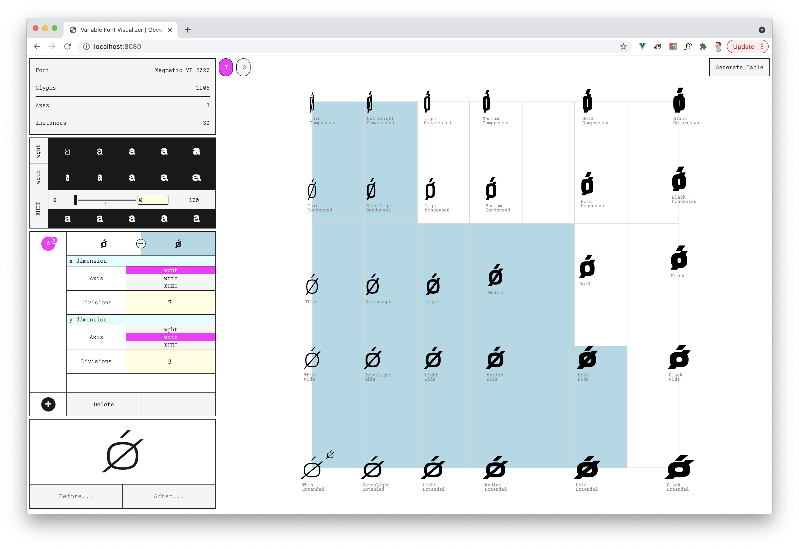

### 6.6 Exporting the Rules Table

Click "Generate Table" in the top right to generate the `<rules>` element for your designspace file. The table will be automatically generated from what you've drawn. You can click "Copy Table" to copy the table to your clipboard and paste it into your `.designspace` file.

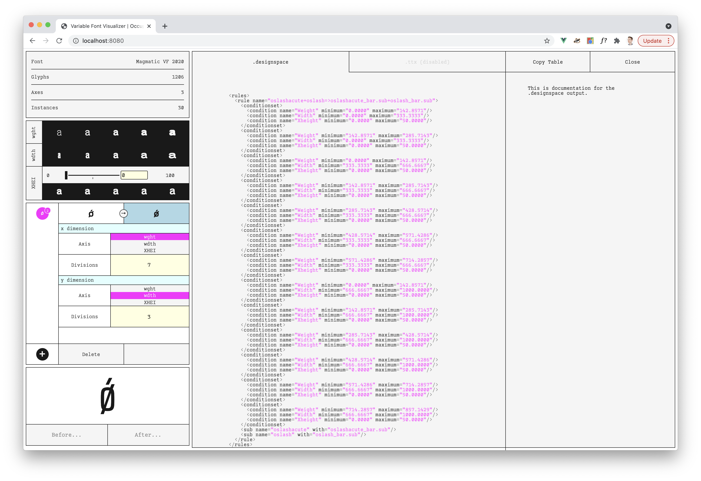

### 7. Updating the `.designspace`

Once you have a `<rules>` table generated and ready to go, you can copy and paste it into the `.designspace` file. I usually paste the `<rules>` XML element into the file near the top: right below the `</axes>` tag.

### 8. Generating the production `.ttf`

Now we're ready to compile the final `.ttf` file with all of our feature variations and substitutions. WE can use `fontmake` again:

```sh
$ fontmake -m UpdatedDesignspaceFile.designspace -o variable
```

This time, we'll have `fontmake` rename our glyphs to their production names.

At this point, you should be ready to drag the file into a testing tool like FontGoggles and check to see if your feature variations and substitutions are working properly.


## Build Setup

``` bash
# install dependencies
npm install

# serve with hot reload at localhost:8080
npm run dev

# build for production with minification
npm run build

# build for production and view the bundle analyzer report
npm run build --report
```

For a detailed explanation on how things work, check out the [guide](http://vuejs-templates.github.io/webpack/) and [docs for vue-loader](http://vuejs.github.io/vue-loader).

## Resources

This is just a list of links to prior work that's been done on the subject.

- [Overview of Feature Variations](https://github.com/irenevl/variable-fonts-with-feature-variations). This is a super useful resource that walks through manually making feature variations with the GSUB table. Basically, it's this process that we're trying to improve a bit.
